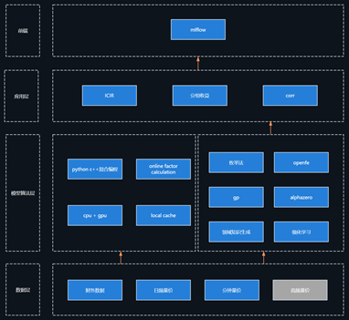

# FACTOR ZOO

Factor Zoo 架构
 

	

## 量价因子

量价因子目前共1049个，采用16年至23年全市场分钟K线数据测试，目标为未来5天的收益率预测。

所有因子的测试结果如下：

[量价因子](https://github.com/chaosquant2022/ML-Quant/tree/main/factor_zoo/runs.md)

- [振幅](https://github.com/chaosquant2022/ML-Quant/tree/main/factor_zoo/runs_amplitude.md)
- [标准差](https://github.com/chaosquant2022/ML-Quant/tree/main/factor_zoo/runs_std.md)
- [高阶矩](https://github.com/chaosquant2022/ML-Quant/tree/main/factor_zoo/runs_higher_moment.md)
- [成交占比](https://github.com/chaosquant2022/ML-Quant/tree/main/factor_zoo/runs_turnover.md)
- [流动性](https://github.com/chaosquant2022/ML-Quant/tree/main/factor_zoo/runs_liquidity.md)
- [量价相关系数](https://github.com/chaosquant2022/ML-Quant/tree/main/factor_zoo/runs_corr.md)
- [极值信息](https://github.com/chaosquant2022/ML-Quant/tree/main/factor_zoo/runs_idx.md)
 
- [券商因子复现](https://github.com/chaosquant2022/ML-Quant/tree/main/factor_zoo/券商因子IC.md)

 

## 基本面因子

## 另类因子

## 事件因子

